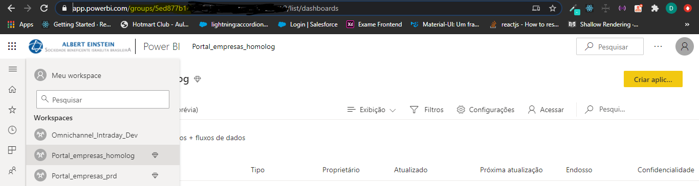
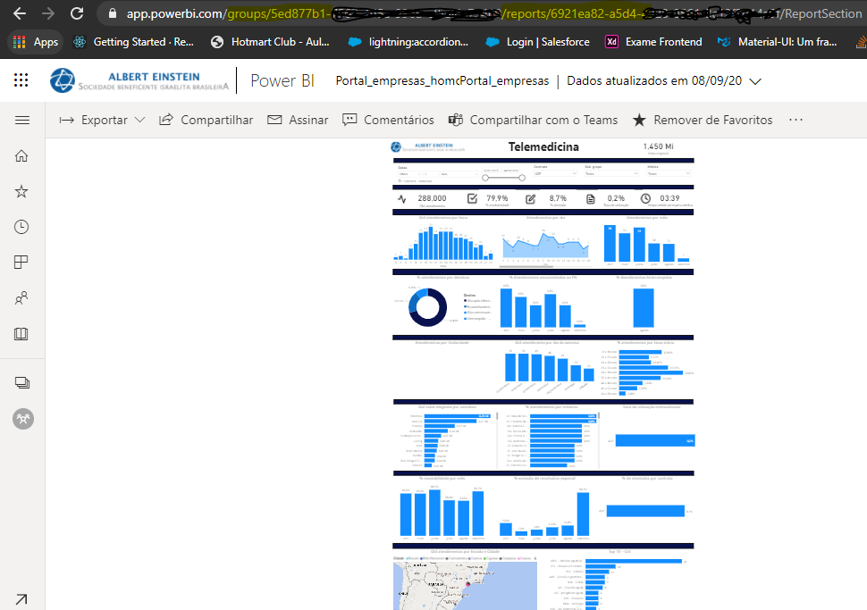
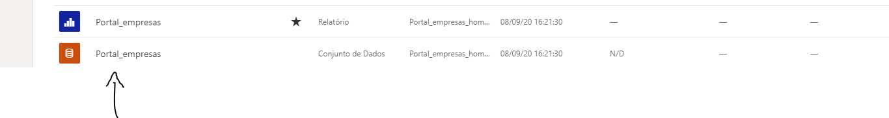
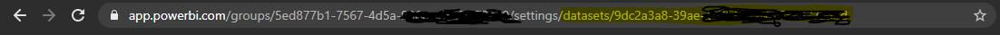

- Captura de dados.
---

# Introdução

Nesta documentação veremos como renderizar um dashboard do Power Bi em javascript.

Vamos separar em três módulos :

- Power Bi
- Front-end
- Back-end

## Power Bi
- Captura de dados do dashboard para as aplicações.

## Front-end (Javascript)
- HTML da aplicação.
- Javascript da aplicação.
- Importação de módulos.

## Back-end (Node)
- Funções para captura do token Azure.
- Funções para captura do token embedado Azure.

# Captura de dados
Captura de dados para renderização do dashboard nas aplicações.

Abra a aplicação do Power Bi e vá até o seu workspace.

Nessa página irá conter o groupId na url (marcado em amarelo).



Escolha o relatório e clique nele

Aqui teremos o reportId e o groupId na url (marcado em amarelo)



Agora iremos pegar o id do dataset do dashboard.

Vá ate o workspace e clique nos três pontos (mais opções) e selecione "configuração"



Na url iremos prgar o datasetId (marcado em amarelo)



Para capturar o clientId e clientSecret siga as intrições nesta Url:
```Link
https://docs.microsoft.com/pt-br/azure/active-directory/develop/howto-create-service-principal-portal
```
